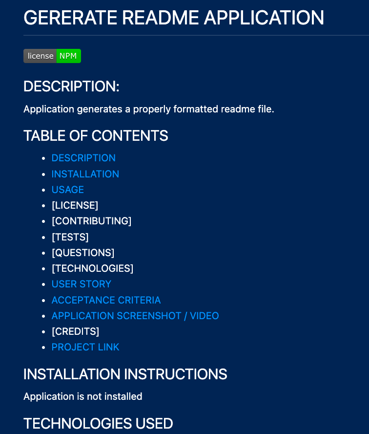

# GENERATE README

## DESCRIPTION:
This project takes user input and generates professional markup readme file.

## TABLE OF CONTENTS
- [DESCRIPTION](#DESCRIPTION)
- [INSTALLATION](#INSTALLATION)
- [USAGE](#USAGE)
- [LICENSE](#LICENSE)
- [CONTRIBUTING](#CONTRIBUTING)
- [TESTS](#TESTS)
- [QUESTIONS](#QUESTIONS)
- [TECHNOLOGIES](#TECHNOLOGIES)
- [USER STORY](#user_story)
- [ACCEPTANCE CRITERIA](#acceptance_criteria)
- [APPLICATION SCREENSHOT / VIDEO](#application_screenshot)
- [CREDITS](#CREDITS)
- [PROJECT LINK](#link_to_github_repo)

## INSTALLATION INSTRUCTIONS
* Application is not installed.

## TECHNOLOGIES USED
* JavaScript,HTML

## USAGE
* Users will run this application in the command-line.

## LICENSES

 
* This application is covered by the NPM license. 

## CONTRIBUTING
* Contact Colin at colin@mdd.io if you want to contribute.

## TESTS
* No tests at this time.

## QUESTIONS
* For any questions please reach out to colin@mdd.io

## USER STORY
* As a user I want to save time creating readme files.

## ACCEPTANCE CRITERIA
* Given when I answer questions about a project the application creates a readme file.

## APPLICATION SCREENSHOT

   
## CREDITS
* na

## LINK TO GITHUB REPO
[README GENERATOR REPO - Click here!]( https://github.com/mcelhatton/readme-generator)
  